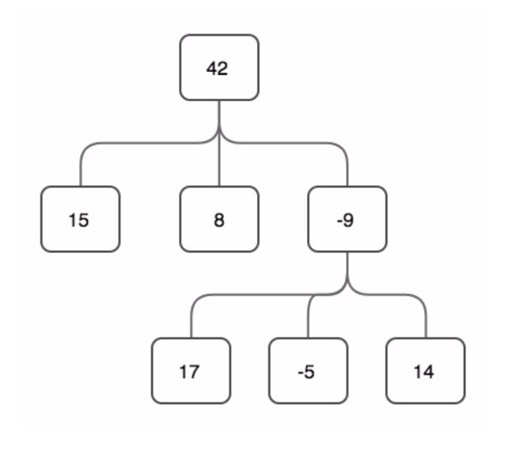

# Tree structure by Ruby

Ruby `>=2.3.0` need

Structure



# Smoke

```bash
git clone https://github.com/dmitryck/ruby_tree.git 

cd ruby_tree

ruby runner.rb

# each
# 42 15 8 -9 17 -5 14

# each2
# 42 15 8 -9 17 -5 14
```

# Description

`Node` is a class for single tree element - node, wich contains self value and children (other nodes) if exists.
Also, it has two similar but diffirent implementation of recurcive each method - `each` and `each2`, wich iterates down to tree struct on every node, starts with provided one

Checkout this difference with env `LOG=1 ruby runner.rb`.

`TreeBilder` is a **highly configurable** nodes tree generator from simple struct description (pure string). By default tree nodes are based on `Node` class, but you can provide another, with nodes functionality (set value, add child and etc).

Keep it mind, that tree builds process requires only one cycle over struct, that means that it **artorithm complexity is equal to N**.

See `runner.rb` file for discover

# Notes
 
No tests version!
